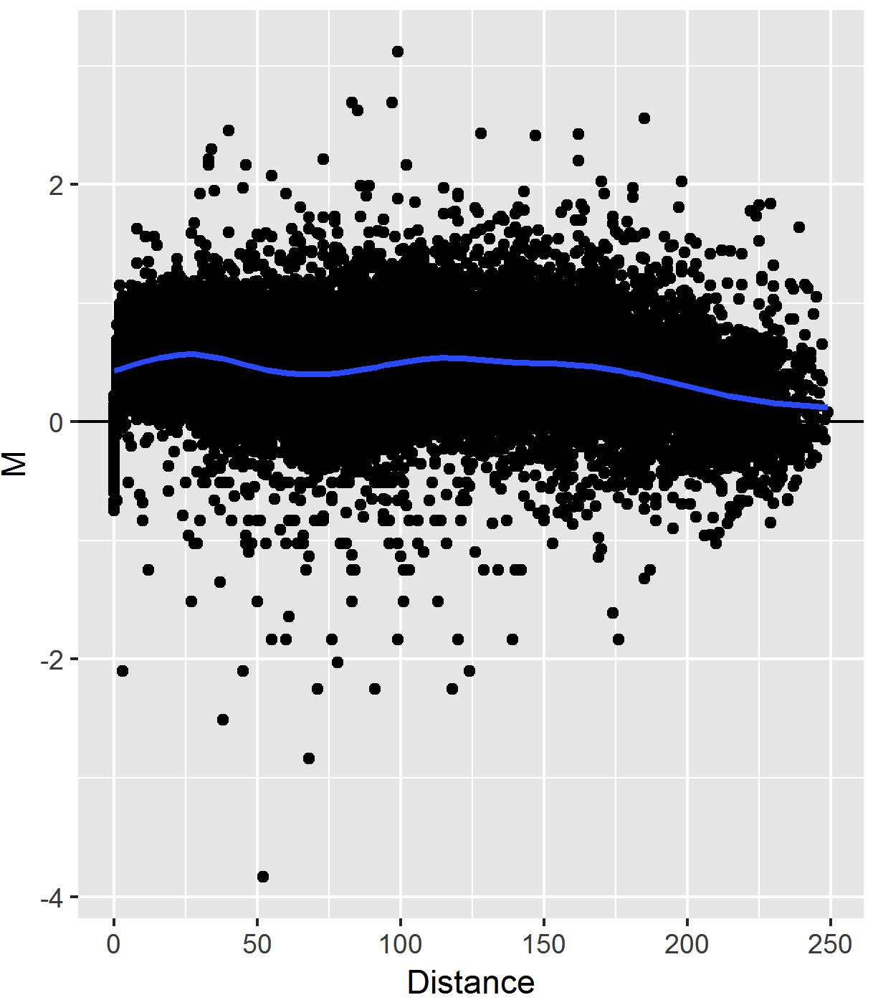

<!-- layout: true
  
<div class="my-footer">

</div>

--- -->

```{r xaringan-themer, include = FALSE}
library(xaringanthemer)
mono_light(
  base_color = "midnightblue",
  header_font_google = google_font("Josefin Sans"),
  text_font_google   = google_font("Montserrat", "500", "500i"),
  code_font_google   = google_font("Droid Mono"),
  link_color = "#8B1A1A", #firebrick4, "deepskyblue1"
  text_font_size = "28px"
)
```

## HiCcompareWorkshop resources

- These slides: [https://mdozmorov.github.io/Talk_HiCcompare](https://mdozmorov.github.io/Talk_HiCcompare)

- GitHub repo: [https://github.com/mdozmorov/HiCcompareWorkshop](https://github.com/mdozmorov/HiCcompareWorkshop)

- Docker image: [https://hub.docker.com/repository/docker/mdozmorov/hiccompareworkshop](https://hub.docker.com/repository/docker/mdozmorov/hiccompareworkshop)

- Pkgdown website: [https://mdozmorov.github.io/HiCcompareWorkshop/](https://mdozmorov.github.io/HiCcompareWorkshop/)

- Start this workshop at [http://workshop.bioc.cancerdatasci.org/](http://workshop.bioc.cancerdatasci.org/)
    - Username: rstudio
    - Password: welcome-to-bioc2020
    - `help(package = "HiCcompareWorkshop")`

---

## The 3D structure of the genome

- Human genome is big - ~3.2 billion base pairs
- ~2 meters (~6ft) of DNA in one cell are packed into the $\sim10\mu m$ nucleus
- ~500 times distance from Earth to Sun in all cells from human body

.center[]
---

## Chromosome conformation capture technologies

The core strategy in 3D genome mapping is nuclear **proximity ligation** (Cullen et al., 1993), which allows detection of distant genomic segments residing in close spatial proximity to one another, yet are linearly far away.

.center[]

.small[ Lieberman-Aiden, Erez, Nynke L. van Berkum, Louise Williams, Maxim Imakaev, Tobias Ragoczy, Agnes Telling, Ido Amit, et al. “[Comprehensive Mapping of Long-Range Interactions Reveals Folding Principles of the Human Genome](https://doi.org/10.1126/science.1181369).” Science, 2009 ]
---

## Hi-C Data as a matrix

.pull-left[
- The genome (chromosome) is split into equally sized regions
- Data is represented by a symmetric matrix of contacts $C_{ij}$ where entry $ij$ corresponds to the number of times region $i$ comes into contact with region $j$
- Off-diagonal data view - increasing **distance** between interacting regions
- Power-law decay of interactions with increasing **distance**
]

.pull-right[

]

---

## Biases in Hi-C data

- Hi-C data suffers from many biases: **sequence-driven** (e.g., mappability, CG content) & **technology-driven** (e.g., type of restriction enzyme, sequencing platform)

- Most normalization methods work only on individual Hi-C dataset, one at a time

- Individual normalization methods do not perform well when the goal is comparison

.small[Lyu, Hongqiang, Erhu Liu, and Zhifang Wu. “[Comparison of Normalization Methods for Hi-C Data](https://europepmc.org/article/med/31588782).” BioTechniques 68, no. 2 (2020)

Zheng, Ye, Peigen Zhou, and Sündüz Keleş. “[FreeHi-C Spike-in Simulations for Benchmarking Differential Chromatin Interaction Detection](https://doi.org/10.1016/j.ymeth.2020.07.001).” Methods, July 2020]
---

## Joint Normalization on the MD plot

.pull-left[
- **MD plot** represents data from two Hi-C matrices on one plot

- Similar to the MA plot (Bland-Altman plot)

- Y-axis: **M**ean differences in interaction frequencies = log2(IF2/IF1)

- X-axis: Genomic **D**istance
]

.pull-right[

]
---

## Joint Loess Normalization of Hi-C Data

.center[]

.small[Lyu, Hongqiang, Erhu Liu, and Zhifang Wu. “[Comparison of Normalization Methods for Hi-C Data](https://europepmc.org/article/med/31588782).” BioTechniques, 2020]

---

## Cyclic loess normalization of multiple Hi-C datasets

Cyclic loess (Ballman et al. 2004) - take each pair of datasets, normalize, repeat until convergence

1. Choose two out of the N total samples then generate an MD plot
2. Fit a loess curve f(d) to the MD plot
3. Subtract f(d)/2 from the first dataset and add f(d)/2 to the second
4. Repeat until all unique pairs have been compared
5. Repeat until convergence

.small[Ballman, Karla V., Diane E. Grill, Ann L. Oberg, and Terry M. Therneau. “[Faster Cyclic Loess: Normalizing RNA Arrays via Linear Models](https://doi.org/10.1093/bioinformatics/bth327).” Bioinformatics (Oxford, England) 20, no. 16 (November 1, 2004)]
---

## Distance-centric chromatin interaction difference detection 

.center[]

.small[Zheng, Ye, Peigen Zhou, and Sündüz Keleş. “[FreeHi-C Spike-in Simulations for Benchmarking Differential Chromatin Interaction Detection](https://doi.org/10.1016/j.ymeth.2020.07.001).” Methods, 2020]

---

## Distance-centric chromatin interaction difference detection 

- **Exact test**
    - For comparing 2 groups without other covariates
    - Similar to Fisher's exact test

- **GLM Methods**
    - For more complex experiments utilize the GLM framework
    - The vector of covariates $x_i$ can be linked with  $\mu_{dgj}$ through a log-linear model $log(\mu_{dgj}) = x_i^T\beta_{dg} + log(M_{dj})$

- Implemented in [edgeR](https://bioconductor.org/packages/edgeR/) R package

---

## Interpretation of differentially interacting chromatin regions (DIRs)

- **Visualization of DIRs.** A Manhattan-like plot of DIRs may inform us about abnormalities or reveal chromosome site-specific enrichment of differentially interacting regions

- **Overlap between differentially expressed genes and DIRs.** If gene expression measurements are available, differentially expressed genes may be tested for overlap with DIRs - test the link between DIRs and changed gene expression

- **Functional enrichment of genes overlapping DIRs.** DIRs may disrupt specific pathways/functions - test whether genes overlapping DIRs are enriched in a canonical pathway or share a common function
---

## Interpretation of differentially interacting chromatin regions (DIRs)

- **Overlap enrichment between TAD boundaries and DIRs.** DIRs may correspond to TAD boundaries that are deleted or created - test DIRs for significant overlap with TAD boundaries detected in either condition or only in boundaries changed between the conditions

- **Overlap between DIRs and binding sites.** DIRs may correspond to locations where proteins bind with DNA, such as CTCF sites - test for overlap between binding site locations and DIRs.
---

## Summary

- **Distance-centric view** of Hi-C data is critical (`MD plot`)

- **Joint loess normalization** effectively removes between-dataset biases (`HiCcompare`, https://bioconductor.org/packages/HiCcompare/)

- **Differential analysis considering distance** has optimal performance (`multiHiCcompare`, https://bioconductor.org/packages/multiHiCcompare/)

.small[
- Stansfield, John C., Kellen G. Cresswell, Vladimir I. Vladimirov, and Mikhail G. Dozmorov. “[HiCcompare: An R-Package for Joint Normalization and Comparison of HI-C Datasets](https://doi.org/10.1186/s12859-018-2288-x).” BMC Bioinformatics (December 2018)

- Stansfield, John C, Kellen G Cresswell, and Mikhail G Dozmorov. “[MultiHiCcompare: Joint Normalization and Comparative Analysis of Complex Hi-C Experiments](https://doi.org/10.1093/bioinformatics/btz048).” Bioinformatics, January 22, 2019
]

---

## HiCcompareWorkshop resources

- These slides: [https://mdozmorov.github.io/Talk_HiCcompare](https://mdozmorov.github.io/Talk_HiCcompare)

- GitHub repo: [https://github.com/mdozmorov/HiCcompareWorkshop](https://github.com/mdozmorov/HiCcompareWorkshop)

- Docker image: [https://hub.docker.com/repository/docker/mdozmorov/hiccompareworkshop](https://hub.docker.com/repository/docker/mdozmorov/hiccompareworkshop)

- Pkgdown website: [https://mdozmorov.github.io/HiCcompareWorkshop/](https://mdozmorov.github.io/HiCcompareWorkshop/)

.center[Get in touch on Twitter [@mikhaildozmorov](https://twitter.com/mikhaildozmorov) <br> or by e-mail `mdozmorov at vcu dot edu`]

.small[ This research was supported by the American Cancer Society [IRG-14-192-40] and the National Institute of Environmental Health Sciences of the National Institutes of Health [T32ES007334] ]